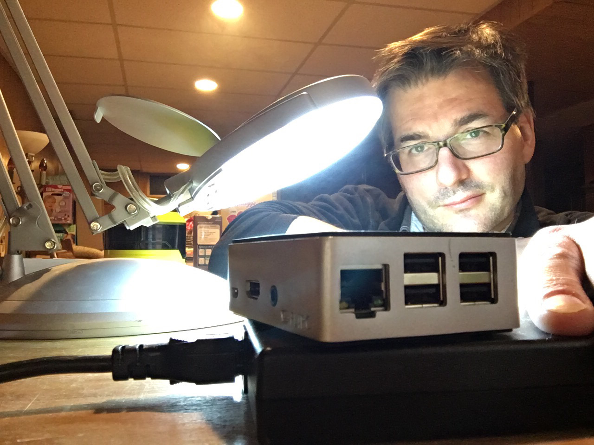

<h2 align="left">Hi 👋! My name is Rich Knowles. </h2>
<h3>Systems Architect & Infrastructure Developer specializing in open-source AI platform safety.</h3>

  

### 🛠️ What I'm Building & Executing Right Now
* **🔭 Active Dev:** [Project Peacock](https://github.com) — An open-source reference Linux MCP server enforcing strict programmatic safety boundaries, filesystem containment, and runtime isolation for autonomous LLM tools.
* **🌱 Core Research:** Mapping threat surfaces across agentic runtime environments, specifically protecting infrastructure against prompt injection, privilege escalation, and sandbox escapes.
* **👯 Open Source Focus:** Hardening localized model orchestration networks and building out multi-tenant infrastructure tooling in Go, Python, and Rust.
* **💬 Technical Focus:** Linux internals, concurrent service discovery, endpoint security, SIEM architecture, and automated enterprise provisioning pipelines.
* **⚡ Beyond the Terminal:** Spent years touring the live music circuit as a professional guitar tech and sound engineer for bands like Slaughter before returning focus entirely back to production infrastructure automation.

### 🧰 Core Tech Stack & Infrastructure

  <!-- Go -->
  
  
  <!-- Python -->
  
  
  <!-- Rust -->
  
  
  <!-- Linux -->
  
  
  <!-- Bash -->
  
  
  <!-- Docker -->
  
  
  <!-- AWS -->
  

### 🔗 Connect

  
  

### 📊 Activity Metrics

  
  

 
